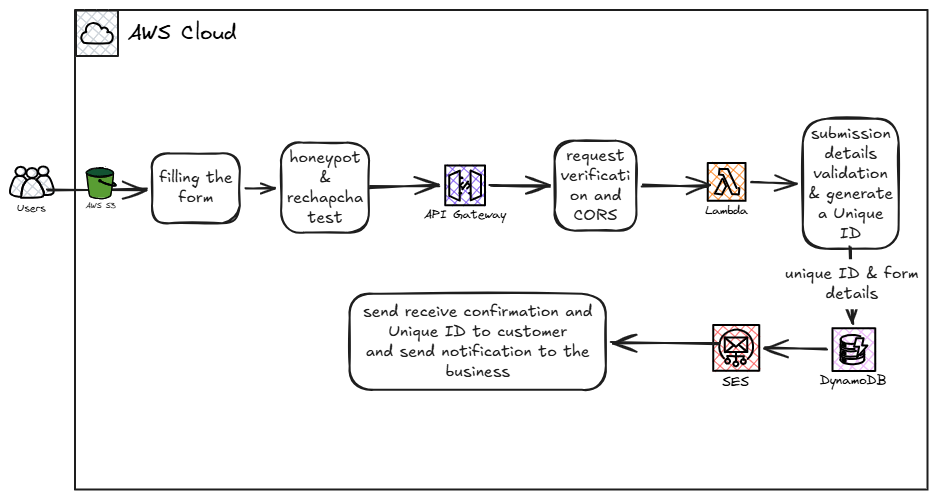
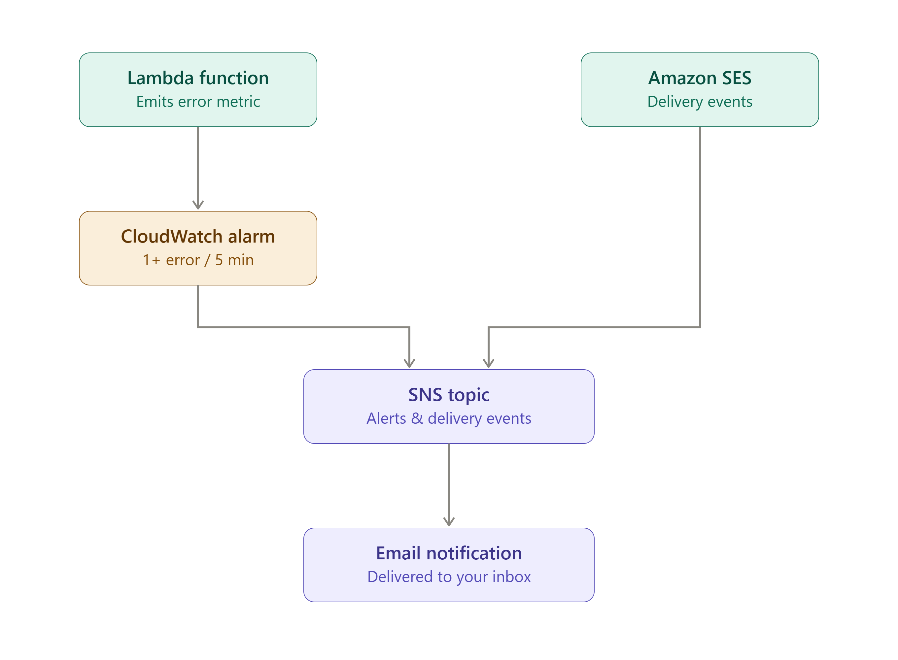

# TravelEase Contact Form - Serverless AWS Solution

A serverless contact form system built for TravelEase Inc., a fictional travel agency transitioning from a basic `mailto:` link to a professional, reliable customer inquiry pipeline. Built entirely with Infrastructure as Code (Terraform) on AWS.

**Demo:** deployed temporarily for testing and recording, then torn down via `terraform destroy` to avoid ongoing hosting costs on a public, unauthenticated endpoint.

See the full walkthrough video below for a live demonstration of the working system.
**Video walkthrough:**

_add your video link here_

**Architecture diagram:** 

see 
 


---

## The Problem

TravelEase's website used a `mailto:` link for customer inquiries. That approach had real business consequences:

- No confirmation that an inquiry was received — a customer asking about a $5,000 vacation package at 9 PM had no reason to wait around, and might book with a competitor instead.
- No reference number, no way to follow up.
- Inquiries could be missed entirely (misconfigured email clients, spam filters).
- Staff manually copied inquiries into spreadsheets, with no standardized format and no way to track response times.
- No spam protection, no data validation, no backup of communication history.

## The Solution

A fully serverless, pay-per-use architecture that replaces the `mailto:` link with a validated, spam-protected contact form backed by managed AWS services — no servers to provision or patch, and cost that scales to zero when there's no traffic.

## Architecture

```
User (browser)
   │
   ▼
Amazon S3 (static site: HTML/CSS/JS)
   │  user fills out form
   ▼
Honeypot field (client-side spam check)
   │
   ▼
Amazon API Gateway  ── POST /submit ── AWS_PROXY integration
   │
   ▼
AWS Lambda (Node.js)
   ├── validates all fields
   ├── generates a unique reference number (UUID)
   ├── writes the submission to DynamoDB (uncaught — a failure here correctly fails the request)
   └── sends two emails via Amazon SES, each independently try/caught
        │
        ├──▶ Amazon DynamoDB   (submission storage, point-in-time recovery enabled)
        └──▶ Amazon SES        ├─ confirmation email → customer
                                └─ notification email → business
                                        │
                                        ▼
                              SES delivery events (bounce / complaint / delivery)
                                        │
                                        ▼
                                  Amazon SNS ──▶ email notification

Amazon CloudWatch watches the Lambda's Errors metric ──▶ alarms to the same SNS topic
```

Full diagram: `/docs/architecture-diagram.png`

## Why Serverless

Every compute and data component in this stack — S3, Lambda, API Gateway, DynamoDB, SES — is pay-per-use with no idle infrastructure to provision, patch, or pay for around the clock. This was a deliberate architectural choice, not a default: an earlier draft of this design used EC2, an Application Load Balancer, NAT Gateways, and DocumentDB inside a VPC — a perfectly valid pattern for some workloads, but the wrong fit here, since it introduces fixed hourly costs and operational overhead for a workload that's bursty and low-volume (a contact form doesn't need 24/7 compute).

## Tech Stack

| Layer | Service | Purpose |
|---|---|---|
| Frontend hosting | Amazon S3 (static website hosting) | Serves `index.html`, `style.css`, `script.js` |
| API layer | Amazon API Gateway (REST API, Lambda proxy integration) | Public HTTPS endpoint, CORS, request routing |
| Compute | AWS Lambda (Node.js 20.x) | Validation, business logic, orchestration |
| Storage | Amazon DynamoDB (on-demand / pay-per-request) | Stores each submission with a unique ID |
| Email | Amazon SES | Sends customer confirmation + business notification |
| IAM | Least-privilege execution role | Scoped `dynamodb:PutItem` (single table ARN), `ses:SendEmail`, CloudWatch Logs actions |
| Monitoring | Amazon CloudWatch + SNS | Alarm on Lambda `Errors` (≥1 in 5 minutes), routed to an SNS topic |
| Delivery tracking | Amazon SNS + SES event destinations | Bounce, complaint, and delivery events published to SNS, delivered by email |
| Backup | DynamoDB point-in-time recovery | Continuous backups, restorable to any point in the last 35 days |
| IaC | Terraform | All 28 resources defined as code, zero manual console resource creation |

## Security & Spam Protection

- **Honeypot field** — a form field hidden from real users via off-screen CSS positioning, but visible to bots that parse raw HTML. If it's filled in on submit, Lambda silently drops the request without writing to the database or sending email. Implemented in both `frontend/index.html` and checked in `lambda/index.js`.
- **Least-privilege IAM** — the Lambda execution role can write to exactly one DynamoDB table (scoped by ARN), send email via SES, and write its own logs — nothing broader.
- **S3 bucket policy** — scoped to `s3:GetObject` only; no write or delete access is granted publicly.
- **CORS** — API Gateway is configured with a full OPTIONS preflight handler (mock integration) alongside the POST method, so only the intended origin's requests are accepted by the browser.

### Future Enhancement: Google reCAPTCHA

The original design called for a second, independent spam-detection layer alongside the honeypot — Google reCAPTCHA. This is **not yet implemented** in the current build; only the honeypot field is live. Adding it would mean:

1. Registering a reCAPTCHA site key + secret key with Google.
2. Loading Google's reCAPTCHA script and rendering the widget in `index.html`.
3. Sending the resulting token alongside the form data in `script.js`.
4. Verifying that token server-side in Lambda — a call to Google's `siteverify` endpoint using the secret key — before proceeding with validation, storage, and email.

Left as a deliberate next step rather than built now, since the honeypot alone already filters the overwhelming majority of naive automated spam for a low-traffic form like this one, and adding a third-party verification call introduces an external dependency (and a new failure mode to handle) worth doing carefully rather than bolting on at the last minute.

## Error Handling & Resilience

The Lambda function deliberately treats its three write operations differently, based on what actually needs to block a successful response:

- **DynamoDB write — no `try/catch`.** If the submission can't be saved, the request genuinely failed, and the customer should see an error. Letting this throw uncaught is the correct behavior, not an oversight.
- **Each SES call — its own separate `try/catch`.** By the time either email is sent, the submission is already safely stored. An email failure shouldn't make the customer think their inquiry was lost. Each email is wrapped independently (not in one shared block) specifically so a failure in the *customer* confirmation doesn't prevent the *business* notification from still being attempted — they're unrelated failures, and one shouldn't block the other. Errors are logged to CloudWatch (not surfaced to the customer) so delivery problems are still visible for debugging.

This means: **a successful HTTP response from this API guarantees the submission was saved — it does not guarantee both emails were delivered.** Email delivery is tracked separately, via the SES → SNS notification pipeline described below.

## Monitoring & Backup

- **CloudWatch alarm** on the Lambda function's `Errors` metric — fires on 1 or more errors within a 5-minute window (deliberately sensitive, given this is a low-traffic contact form where any failure is worth investigating immediately), routed to an SNS topic.
- **SES event destinations** — Bounce, Complaint, and Delivery events are published to the same SNS topic, so delivery problems with either outbound email surface as a notification rather than requiring someone to check logs manually.
- **DynamoDB point-in-time recovery** — enabled on the submissions table, allowing restoration to any point within the last 35 days.
- **DynamoDB capacity monitoring** (mentioned in the original brief) was deliberately **not** implemented — the table uses `PAY_PER_REQUEST` billing, which has no fixed provisioned capacity to run out of or throttle against. That specific concern applies to `PROVISIONED` tables, not this one.

## Repository Structure

```
travelease-contact/
├── frontend/
│   ├── index.html
│   ├── style.css
│   └── script.js
├── infrastructure/
│   ├── provider.tf
│   ├── s3.tf
│   ├── dynamodb.tf
│   ├── iam.tf
│   ├── lambda.tf
│   ├── lambda_permission.tf
│   ├── api_gateway.tf
│   ├── deployment_stage.tf
│   ├── ses.tf
│   ├── monitoring.tf        # SNS topic/subscription, SES event destinations, CloudWatch alarm
│   ├── archive.tf
│   ├── outputs.tf
│   ├── variables.tf
│   ├── terraform.tfvars
│   └── backend.tf
├── lambda/
│   ├── index.js
│   └── package.json
└── docs/
    └── architecture-diagram.png
```

## Deployment

**Prerequisites**
- AWS account with an IAM user configured for CLI access (`aws configure`)
- Terraform installed
- Two SES-verified email addresses (sender + a recipient stand-in, since new AWS accounts start in SES sandbox mode)

**Steps**

```bash
# 1. Clone and enter the infrastructure directory
git clone https://github.com/fatemehfeizipour/travelease-contact.git
cd travelease-contact/infrastructure

# 2. Initialize Terraform
terraform init

# 3. Review the plan
terraform plan

# 4. Deploy (creates 28 AWS resources)
terraform apply

# 5. Note the outputs
#    - gateway_url → your API Gateway invoke URL
#    - s3_url      → your static website endpoint
```

```bash
# 6. Install Lambda dependencies before Terraform packages the function
cd ../lambda
npm install

# 7. Re-apply so the zip includes node_modules
cd ../infrastructure
terraform apply
```

**Connect frontend to backend**

Open `frontend/script.js` and set:
```js
const API_URL = "<your gateway_url output>/submit";
```

Then upload the three frontend files to your S3 bucket (via console, CLI, or a small `aws s3 sync` command) and visit the `s3_url` output.

**One more manual step after `apply`:** the SNS topic subscription requires email confirmation, the same way SES identity verification does — AWS will send a confirmation link to the subscribed address, and the subscription stays pending until it's clicked. Terraform can create the subscription resource, but can't click the link for you.

## A Note on Lambda Structure — One Function vs. Three

The implementation guide specifies a single Node.js Lambda function handling validation, the DynamoDB write, and both SES sends — which is what this repo builds. A different, more elaborate reference architecture circulates for this same project showing **three separate Lambdas** (one for the DynamoDB write, one per outbound email), most likely wired together with DynamoDB Streams so the email functions fire automatically after a write, fully decoupled from it.

Both are legitimate patterns:

- **Single Lambda (this repo):** fewer resources, one IAM role, simpler to reason about and deploy — a good fit for a low-traffic contact form. The risk (an email failure blocking a successful response) is closed with the `try/catch` structure described above, rather than architectural separation.
- **Three Lambdas:** each concern is fully independent — an email failure can never affect whether the database write succeeded, since they're separate invocations entirely. Comes at real cost: three IAM roles, DynamoDB Streams enabled, an event source mapping, and more moving parts to monitor and pay for.

Neither is "wrong" — it's a trade-off between simplicity/cost and architectural isolation, and worth choosing deliberately based on the brief's actual requirements and expected scale, rather than defaulting to whichever pattern looks more sophisticated.

## What I Learned

- Designing a request flow end-to-end before writing any code — tracing exactly what happens from form submission to email delivery — made every infrastructure decision (dependency order, IAM scope, integration type) fall out naturally instead of feeling arbitrary.
- The difference between identity-based IAM policies ("what can I do") and resource-based policies ("who can call me") — and why AWS requires an explicit `aws_lambda_permission` grant even after API Gateway and Lambda already reference each other.
- CORS preflight requests are a separate, silent requirement — a working POST integration is not enough on its own; the browser's OPTIONS preflight has to be handled explicitly via a mock integration.
- Least-privilege IAM in practice means splitting a policy into multiple statements when different actions need different resource scopes, since a single statement applies its resource list to every action in it.
- Not every operation in a function deserves the same failure behavior. Deciding *which* calls should be allowed to fail the whole request (the DynamoDB write) versus which should fail quietly and independently of each other (each SES call, in its own `try/catch`) mattered more than just "add error handling everywhere."
- A written spec and a circulating diagram can disagree — the implementation guide's text and prescribed file structure (one `index.js`) both pointed to a single Lambda, while a separate diagram showed three. Checking the primary source (the actual brief text) resolved it, rather than assuming the more complex-looking option was the intended one.
- Public, unauthenticated endpoints (by design — a contact form can't require a login) don't have a hard ceiling on pay-per-use cost unless you add one. Rather than leave the demo running indefinitely, I deployed it temporarily for testing and the walkthrough recording, then destroyed the stack — a live URL is nice, but not worth an open-ended cost commitment for a portfolio piece.

## Author

Fatemeh Feyzipour — [LinkedIn](https://www.linkedin.com/in/fatemeh-feyzipour) · [GitHub](https://github.com/fatemehfeizipour)
